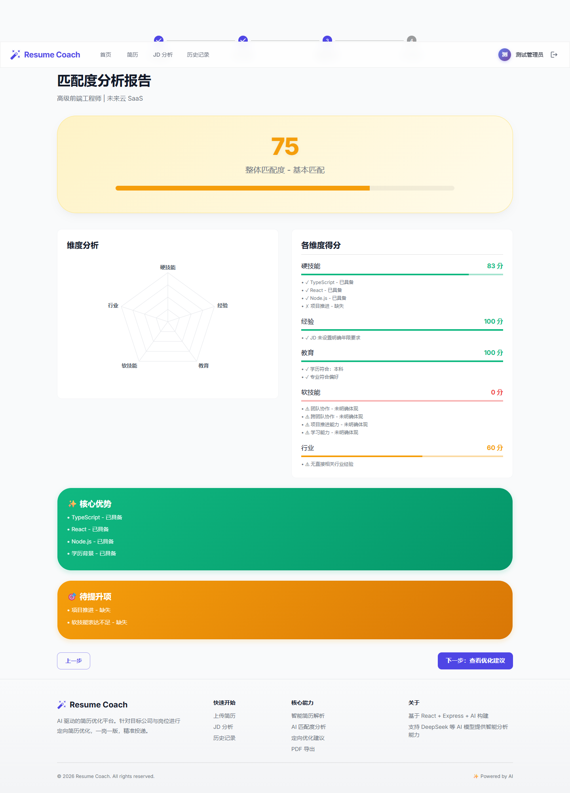
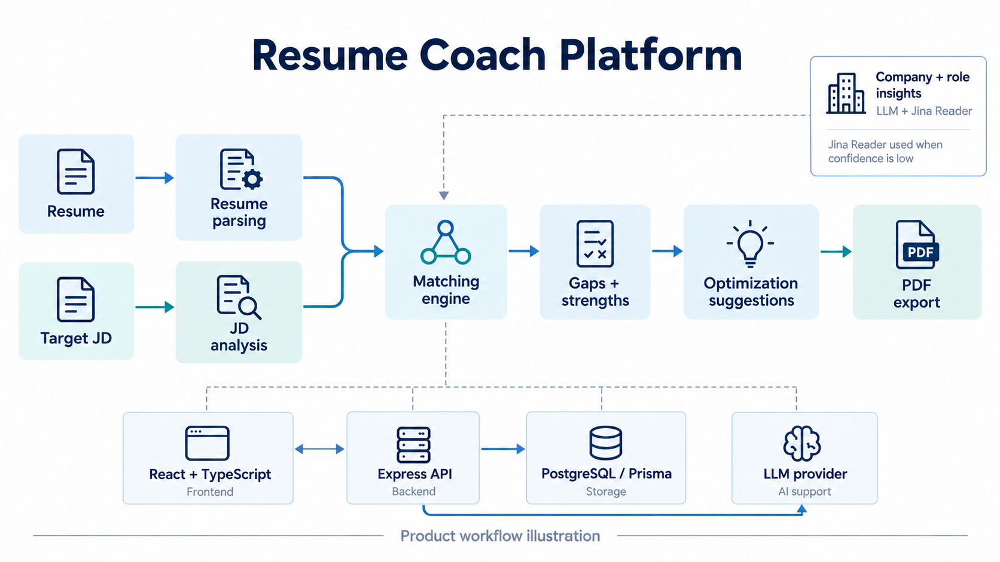
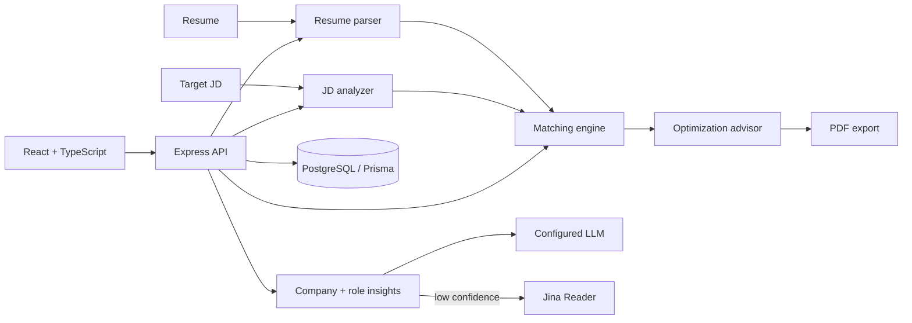

# Resume Coach Platform

AI-powered resume-to-JD matching and targeted optimization, built with React, TypeScript, Express and LLMs.

根据目标岗位分析简历匹配度，定位优势与差距，并生成可应用的优化建议。

**[在线试用 / Live Demo](http://43.139.47.80:8080/)** · [演示说明 / Demo guide](./docs/DEMO.md#hosted-demo)

在线版本为测试部署，打开后进入登录页。登录后可使用内置示例简历体验岗位匹配与优化建议。



## Problem and solution

通用简历难以说明与某个岗位的匹配程度。本项目将简历与 JD 结构化，输出维度评分、差距和优先级建议，并支持修改预览与 PDF 导出。

The workflow connects resume parsing, JD analysis, matching, targeted suggestions and PDF export. Existing [demo screenshots](./docs/DEMO.md) show the application; the diagram below illustrates its workflow.



## Architecture


```mermaid
flowchart LR
  Resume["Resume"] --> Parser["Resume parser"]
  JD["Target JD"] --> Analyzer["JD analyzer"]
  Parser --> Matcher["Matching engine"]
  Analyzer --> Matcher
  Matcher --> Advice["Optimization advisor"] --> PDF["PDF export"]
  Browser["React + TypeScript"] --> API["Express API"]
  API --> Parser
  API --> Analyzer
  API --> Matcher
  API --> DB[("PostgreSQL / Prisma")]
  API --> Insight["Company + role insights"]
  Insight --> LLM["Configured LLM"]
  Insight -->|low confidence| Jina["Jina Reader"]
```

## Key engineering

- **Structured inputs:** PDF / Word resume parsing and JD analysis, with a local rule-based matching path when AI is unavailable.
- **Targeted advice:** strengths, gaps and before/after suggestions for the selected job; the user decides which suggestions to apply.
- **Company × JobTitle insights:** LLM knowledge with confidence and source markers; low-confidence results can use Jina Reader to supplement public website content.
- **Application infrastructure:** JWT authentication, Prisma / PostgreSQL persistence, optional Redis cache, request limiting, error handling, health and metrics endpoints.
- **Document output:** Chinese PDF preview and export, plus resume versions for different applications.

| Layer | Stack |
| --- | --- |
| Frontend | React, Vite, TypeScript, MUI |
| Backend | Node.js, Express, TypeScript |
| Storage | PostgreSQL, Prisma; optional Redis |
| AI | DeepSeek / DashScope / OpenAI-compatible API |
| Delivery | PDFKit, Docker, Nginx |
| Tests | Jest, Supertest |

## Quick start

Requires Node.js 20+, npm 10+ and PostgreSQL for normal persistent use.

```bash
npm install
cd frontend
npm install
cd ..
cp .env.example .env
```

Set `DATABASE_URL`, a strong `JWT_SECRET`, and the AI provider configuration in `.env`. Redis is optional. Then initialize the database and start the backend:

```bash
npm run prisma:generate
npx prisma db push
npm run dev
```

In a second terminal:

```bash
cd frontend
npm run dev
```

Local frontend: `http://localhost:5173`; local backend: `http://localhost:3001`. See [complete setup and API reference](./docs/SETUP_REFERENCE.md) and [deployment guide](./DEPLOYMENT.md) for production, Docker, admin and Chinese PDF font configuration.

## Demo and verification

The existing demo test checks the matching engine without a database, external AI calls or a running frontend:

```bash
npx jest --runInBand --runTestsByPath tests/demo.matching.test.ts
```

Full checks: `npm run lint`, `npm run build`, `npm test`, and `npm run build` inside `frontend`.

The earlier README records a full check on **2026-06-16**: TypeScript, ESLint, 127/127 Jest tests and frontend build passed. This is a historical result, not a claim that those checks were rerun for this documentation revision.

## Further reading

- [Demo inputs, outputs and screenshots](./docs/DEMO.md)
- [Full setup and API reference](./docs/SETUP_REFERENCE.md)
- [Development guide](./DEV.md) · [Deployment](./DEPLOYMENT.md)
- [Roadmap](./ROADMAP.md) · [Contributing](./CONTRIBUTING.md)

Production authentication requires persistent storage. Memory test accounts are for local testing; keep real credentials and uploaded resumes out of Git.

## Author and license

**Leo Leung** · Biomedical Engineering · Embedded Systems · AI Tools

[MIT](./LICENSE)
