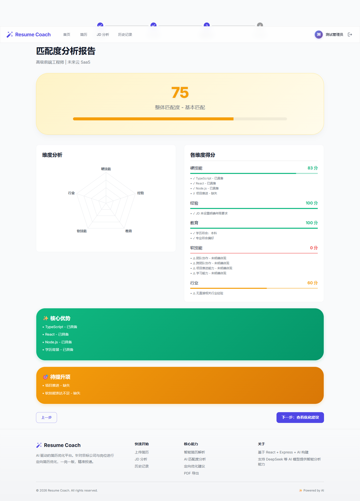
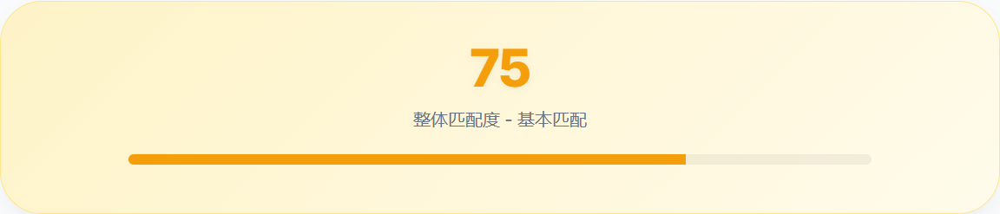
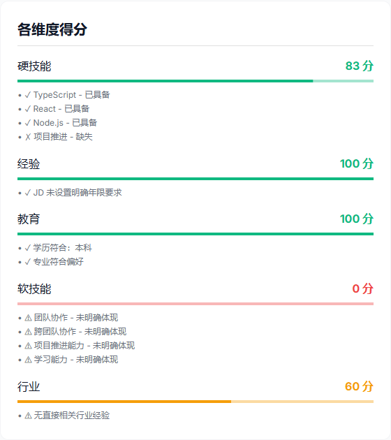
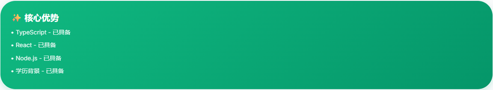
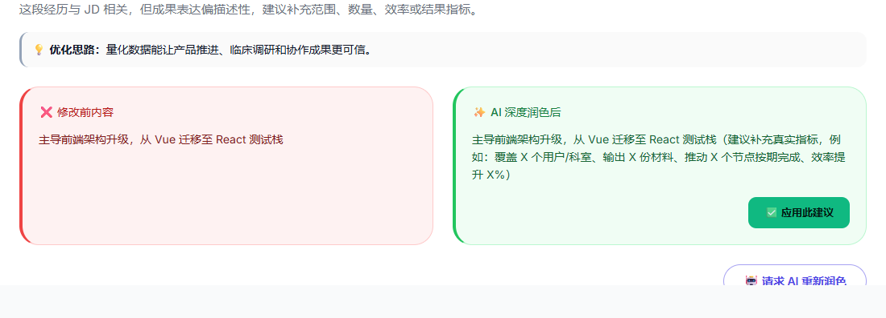

# Demo Preview

This page shows both a static expected-output preview and screenshots from an actual local run of the website. It is designed for GitHub readers who want to understand what the product looks like before running the application locally.


## Live Website Run

The screenshots below were captured from a real local run of the React + Express app:

1. Log in with the local test account.
2. Load the built-in resume template.
3. Enter a target Senior Frontend Engineer JD.
4. Generate the match report.
5. Open optimization suggestions and expand a rewrite card.

### Match Report



### Scoring Details

The match page separates the score into an overall result and dimension-level evidence.

| Overall score | Dimension scores |
| --- | --- |
|  |  |

| Strengths | Improvement areas |
| --- | --- |
|  |  |

Observed result:

| Field | Value |
| --- | --- |
| Job | 高级前端工程师 |
| Company | 未来云 SaaS |
| Overall score | `75` |
| Skill score | `83` |
| Experience score | `100` |
| Education score | `100` |
| Main strengths | TypeScript, React, Node.js, education background |
| Improvement areas | Project delivery wording, soft-skill expression, SaaS industry relevance |

### Resume Rewrite Preview

The optimization page shows a before/after comparison and an “apply suggestion” button:



Example rewrite:

| Before | After |
| --- | --- |
| 主导前端架构升级，从 Vue 迁移至 React 测试栈 | 主导前端架构升级，从 Vue 迁移至 React 测试栈（建议补充真实指标，例如：覆盖 X 个用户/科室、输出 X 份材料、推动 X 个节点按期完成、效率提升 X%） |

Clicking “应用此建议” updates the current resume data used by subsequent PDF preview/export.

## Automated Demo Test

The automated demo test creates a sample full-stack resume and a target Senior Full-stack Engineer JD, then runs the local rule-based matching engine.

It does not require:

- A real PostgreSQL database
- DeepSeek, DashScope, or OpenAI API keys
- The frontend development server

## Sample Input

| Type | Example |
| --- | --- |
| Resume | Alex Chen, Full-stack Engineer |
| Resume skills | React, TypeScript, Node.js, PostgreSQL |
| Resume background | SaaS analytics dashboard and cross-functional collaboration |
| Target JD | Senior Full-stack Engineer |
| JD requirements | React, TypeScript, Node.js, PostgreSQL, SaaS experience |

## Expected Output

| Field | Expected value |
| --- | --- |
| `aiPowered` | `false` |
| `overallScore` | `>= 90` |
| `dimensions.skill.score` | `100` |
| `dimensions.industry.score` | `100` |
| Strengths | Includes `React` |
| Gaps | Does not include `React` |

Example assertion:

```ts
const result = await calculateMatch(demoResume, targetJD);

expect(result.aiPowered).toBe(false);
expect(result.overallScore).toBeGreaterThanOrEqual(90);
expect(result.dimensions.skill.score).toBe(100);
expect(result.dimensions.industry.score).toBe(100);
expect(result.strengths).toEqual(
  expect.arrayContaining([
    expect.objectContaining({ item: 'React', matched: true }),
  ])
);
expect(result.gaps).not.toEqual(
  expect.arrayContaining([
    expect.objectContaining({ item: 'React' }),
  ])
);
```

## Run It Locally

Start the app:

```bash
# Terminal 1
set AUTH_MEMORY_FALLBACK=true
set JWT_SECRET=resume-coach-local-demo-secret-key-123456
npm run dev

# Terminal 2
cd frontend
npm run dev -- --host=127.0.0.1 --port=5173
```

Open:

```txt
http://127.0.0.1:5173
```

Local test account:

```txt
email: admin@example.com
password: 123456
```

Run the automated test:

```bash
npm install
npx jest --runInBand --runTestsByPath tests/demo.matching.test.ts
```

Run the full suite:

```bash
npm test
```

The full runnable test lives in [`tests/demo.matching.test.ts`](../tests/demo.matching.test.ts).
